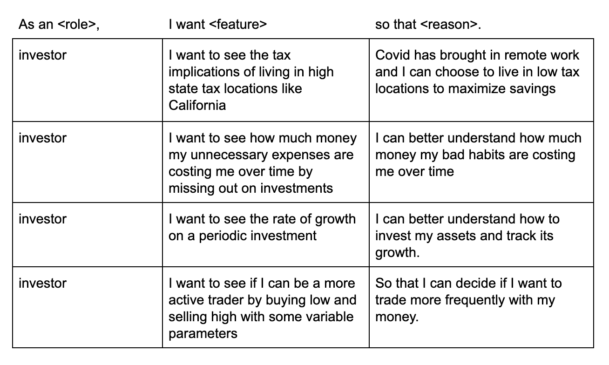
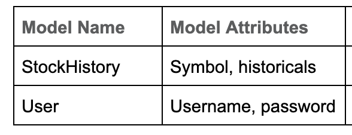

# Quan
## <i>Investment Laid Bear</i>

### [Deployed](https://fast-mesa-56626.herokuapp.com/) Link || Git Hub [Repository]( https://github.com/GabeSucich/InvestmentSimluator)

 <b>Quan</b>  - Final Product Preview
 

    

## Usage

For detailed information regarding the investment strategies of the app, please read the markdown provided on <b>Strategies.md</b> which is listed above.

## Table of Contents 
* [User Stories](#User_Stories)

* [Models](#models)

* [Future Developments](#future_developments)

* [Take Aways](#take_aways)

* [Technologies Used](#technologies_used)

* [Contributors | Contact](#Contributors)

## Summary and Overview

For this project, our team decided to create an app that would provide a variety of investment strategies to users that may or may not already know about stock market investing.

<b>Quan</b> provides Basic, Intermediate, and Advanced strategies that cover saving & investment analysis, buy-and-wait basics, state tax income tax comparisons, and active-trading buy and sell simulations. 

## User_Stories

    

 <b>Multiple Strategies - see <b>Strategies.md</b> for details.</b>
 

    

## Models

    

Through the third party API - [Alpha Vatage](https://www.alphavantage.co/documentation/) - we were able to acquire stock data from the past fifteen years; and were able to mold that data into our StockHistory model. The second model - User - was to collect the login information for everyone that visits the site. 

## Future_Developments

Although our team was restricted on time, we do have plans for future development which include:

 1) Optimizing algorithmic accuracy 
 
 2) Create a basic machine learning / tracking algorithm to track best case parameters
 
 3) Develop more advanced predictive strategies

 
______________

## Take_Aways

...

## Technologies_Used

- MERN Stack
- Chart.js
- Visual Studio Code
- Git / GitHub / Heroku
- Trello / Slack

## Contributors

<h2 align="center">
Gabe Sucich
 </h2>

    

[GitHub](https://github.com/GabeSucich) | [LinkedIn](https://www.linkedin.com/in/gabriel-sucich-6a28a71a8/) | [Portfolio](https://gabesucich.github.io/Portfolio2/)

<h2 align="center">
Joel Mathen
 </h2>

    

[GitHub](https://github.com/crackedsnowboard) | [LinkedIn](https://www.linkedin.com/in/joel-mathen/) | [Portfolio](https://crackedsnowboard.github.io/portfolio-highlights/)

<h2 align="center">
Samuel Levi Barrow
 </h2>

    

[GitHub](https://github.com/sbarrow825) | [LinkedIn](https://www.linkedin.com/in/sam-barrow/) | [Portfolio](https://sbarrow825.github.io/Unit-02-CSS-and-Bootstrap-Homework-Responsive-Portfolio/)

<h2 align="center">
Colin Whitcomb
 </h2>

    

[GitHub](https://github.com/Colin-Whitcomb) | [LinkedIn](https://www.linkedin.com/in/colin-whitcomb-b808301a6/) | [Portfolio](https://colin-whitcomb.github.io/React_Portfolio/)
